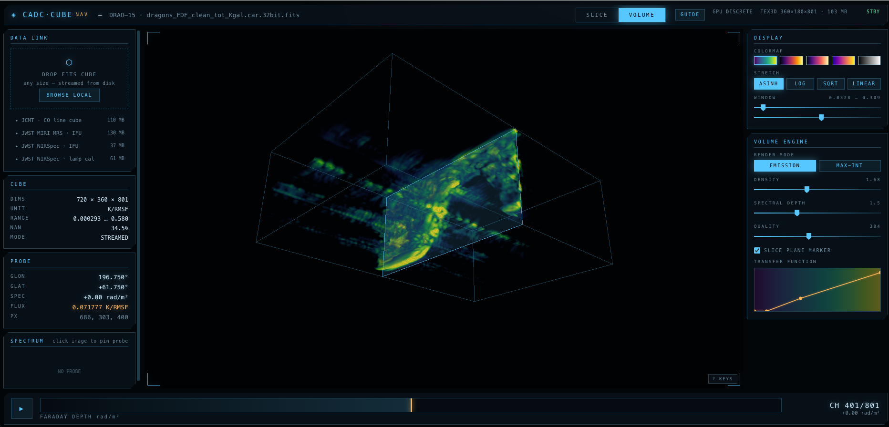
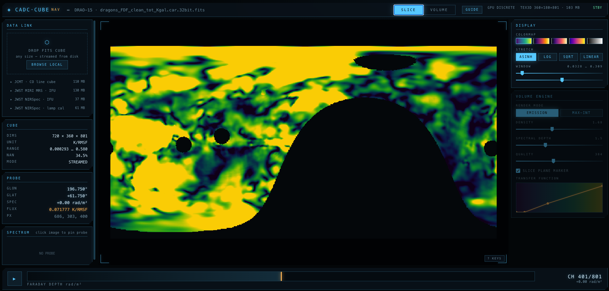
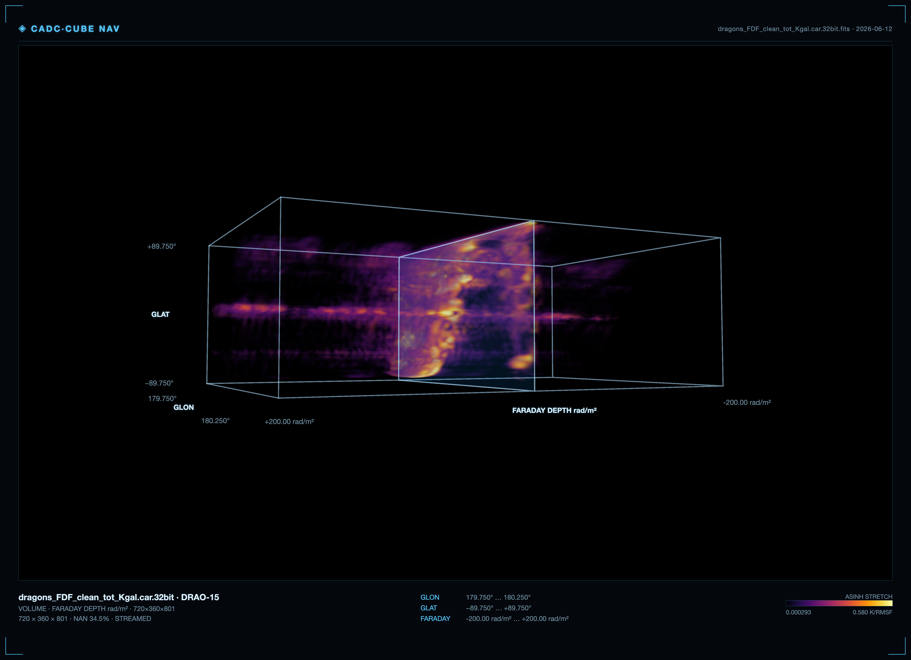

# v-cube

**A Canadian Astronomy Data Centre (CADC) visualization tool** — a browser-based FITS
spectral-cube viewer with linked **slice** and **volume** modes, presented as a
high-resolution spacecraft-navigation cockpit. Everything runs client-side: cubes stream
from disk with byte-range reads, so multi-gigabyte cubes open without loading into RAM, and
no data ever leaves your machine.

[](https://github.com/szautkin/v-cube/actions/workflows/ci.yml)
[](LICENSE)
[](https://www.typescriptlang.org/)
[](https://threejs.org/)
[](https://vitejs.dev/)
[](https://prettier.io/)
[](CONTRIBUTING.md)



---

## What it is

v-cube turns a FITS spectral cube into two linked, GPU-accelerated views:

- **Slice mode** — the quantitative view. Each channel is drawn at native resolution; every
  pixel is the true voxel value from the file. Hover for world coordinates (RA/Dec or
  Galactic ℓ/b) and spectral coordinate (frequency, wavelength, velocity, Faraday depth) plus
  the exact intensity in native units. Click to pin a spectrum through any spaxel.
- **Volume mode** — the qualitative view. Front-to-back ray-marching of a downsampled 3D
  texture, with an editable transfer function, per-axis aspect control, and adaptive quality.
  Use it to locate structure, then click a feature to jump slice mode to that channel.

The two modes share one normalization, stretch, and colormap, so a feature that looks bright
in one is bright in the other — but only slice mode tells you _how_ bright.

### Slice mode — Galactic Faraday field



### Publication figure plate (PNG / print-to-PDF)



## Features

- **Hand-rolled FITS reader** — float and integer cubes, multi-HDU, big-endian, BSCALE/BZERO/BLANK,
  per-channel streaming via `File.slice` / HTTP range. No external FITS dependency.
- **WCS readouts you can trust** — TAN (gnomonic) and CAR (plate carrée) projections, equatorial
  and Galactic frames, FREQ→velocity, wavenumber→nm, and JWST `WAVE-TAB` lookup tables. Pixel
  fallback when there is no sky WCS.
- **NaN-aware throughout** — blank voxels are masked in slice mode, transparent in volume mode,
  and excluded from the robust (0.1–99.9 percentile) statistics that anchor normalization.
- **Handles cubes that do not fit** — small cubes load fully into RAM; large ones stream channel
  planes on demand and bin to fit the GPU's `MAX_3D_TEXTURE_SIZE`. Multi-GB cubes are routine.
- **Publication export** — render the active view off-screen at 2×/4×, compose a figure plate
  (cockpit frame, header, axis captions, legend, labeled colorbar), and save as **PNG** or
  **print to PDF**. Transparent-background and journal-light themes for papers.
- **Spacecraft HUD** — a dark glass cockpit with telemetry readouts, a channel scrubber showing
  the cube-mean spectrum, idle auto-orbit, and a built-in operating guide.
- **Hardware-accelerated** — requests the discrete GPU (`powerPreference: 'high-performance'`)
  and renders at reduced resolution while you interact, refining when you stop.

## Quick start

```bash
git clone https://github.com/szautkin/v-cube.git
cd v-cube
npm install
npm run dev          # http://localhost:5173
```

Then drop a FITS cube anywhere in the window, or click **DROP FITS CUBE / BROWSE**.

To build a static bundle:

```bash
npm run build        # type-checks, then emits dist/
npm run preview      # serve the production build
```

The build is a static site — deploy `dist/` behind any web server, or use the included
`Dockerfile` (`docker build -t v-cube . && docker run -p 8080:80 v-cube`).

## Supported data

v-cube reads **3-axis FITS image cubes** (`.fits` / `.fit` / `.fts`), integer or float, of any
size. It has been exercised against JCMT ACSIS, JWST NIRSpec & MIRI MRS IFU `s3d` products,
DRAO Faraday-depth cubes, and Galactic-plane survey cubes. HDF5 is intentionally **not**
supported — convert to FITS first (e.g. SITELLE products).

## Using it well

The intended workflow is **volume to find, slice to read**:

1. Open volume mode (`V`) and orient — anything glowing is candidate signal.
2. Click a feature; the brightest channel along the ray is located and you land in slice mode there.
3. Hover to read true RA/Dec/velocity/flux; scrub `←/→` to walk the line profile.
4. Click a pixel to pin its spectrum.

**Trust contract:** slice mode is quantitative (native-resolution file values — use it for
anything you write down); volume mode is qualitative (binned, quantized, shaped by the transfer
function — never measure flux or size from it). Press **G** in-app for the full operating guide.

**Keys:** `←/→` channel · `⇧←/→` ×10 · `Space` play · `V` mode · `G` guide · `R` reset view ·
double-click fit · wheel zoom · drag pan/orbit.

## Architecture

```
src/
  fits/        DataSource (File/Buffer/HTTP-range) · parser · WCS
  data/        CubeModel — ingest, NaN-aware stats, streaming, volume texture build
  render/      sliceView · volumeView (ray-march) · colormaps
  ui/          spectrum · transfer-function editor · tooltips
  export.ts    off-screen render, annotation bar, figure-plate composition
  main.ts      app wiring, state, render loop
```

Everything above the byte layer talks to one `DataSource` interface (`read(offset, length)`),
so the same code path serves a local `File`, an in-memory buffer, or — in future — a remote
archive URL via HTTP range requests.

## Testing

```bash
npm test             # vitest unit tests (parser, WCS, stats, ingest)
npm run typecheck    # tsc --noEmit
npm run lint         # eslint
npm run format:check # prettier
```

Beyond unit tests, the repo includes **visual-truth** end-to-end harnesses
(`scripts/verify-*.mjs`): they load a synthetic cube whose every voxel value is analytically
known, then assert that the on-screen probe readouts _and the actual rendered canvas pixels_
match an independent CPU computation of `colormap(stretch(normalize(value)))`. Run them against
a live dev server (see [CONTRIBUTING.md](CONTRIBUTING.md)).

## Contributing

Contributions are welcome — see [CONTRIBUTING.md](CONTRIBUTING.md) and our
[Code of Conduct](CODE_OF_CONDUCT.md). Good first areas: additional WCS projections, colormaps,
instrument-specific quirks, and accessibility.

## License

v-cube is licensed under the **GNU Affero General Public License v3.0 or later** (AGPL-3.0),
matching the [OpenCADC](https://github.com/opencadc) ecosystem it is built for. See [LICENSE](LICENSE).
The AGPL's network clause means that if you run a modified v-cube as a hosted service, you must
make your modified source available to its users.

## Acknowledgements

Built for the [Canadian Astronomy Data Centre (CADC)](https://www.cadc-ccda.hia-iha.nrc-cnrc.gc.ca/)
and inspired by the [OpenCADC](https://github.com/opencadc) tools. Rendering by
[three.js](https://threejs.org/); tooling by [Vite](https://vitejs.dev/) and
[Vitest](https://vitest.dev/). Sample imagery rendered from public JCMT, JWST, and DRAO data.
